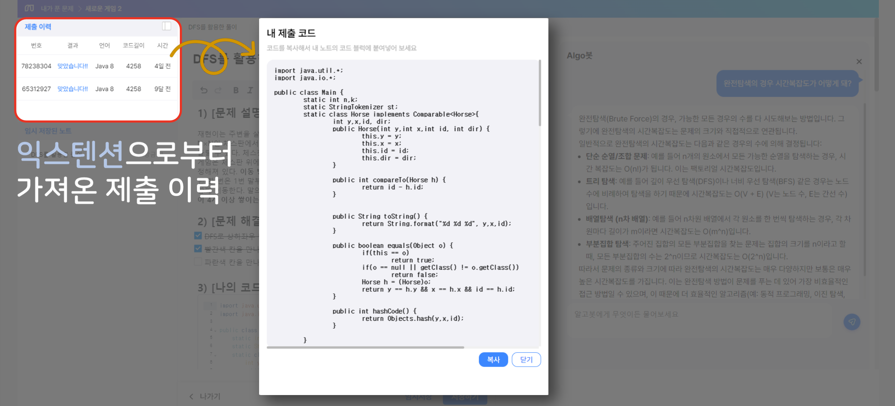
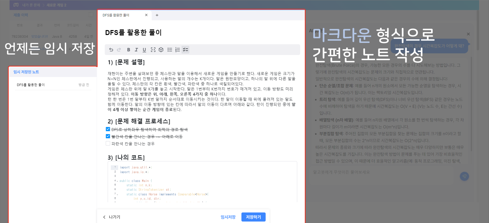
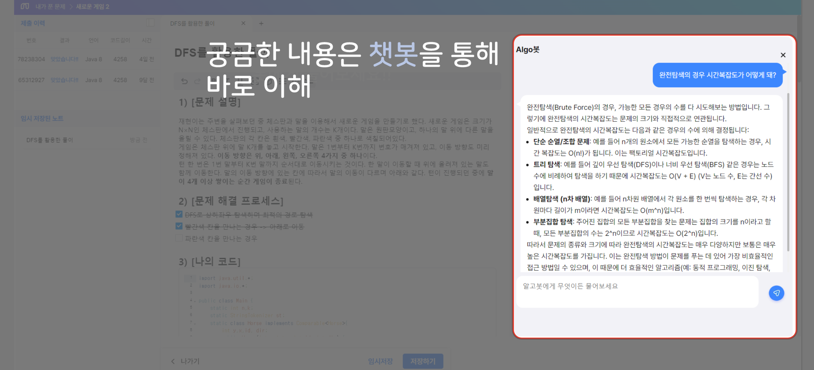
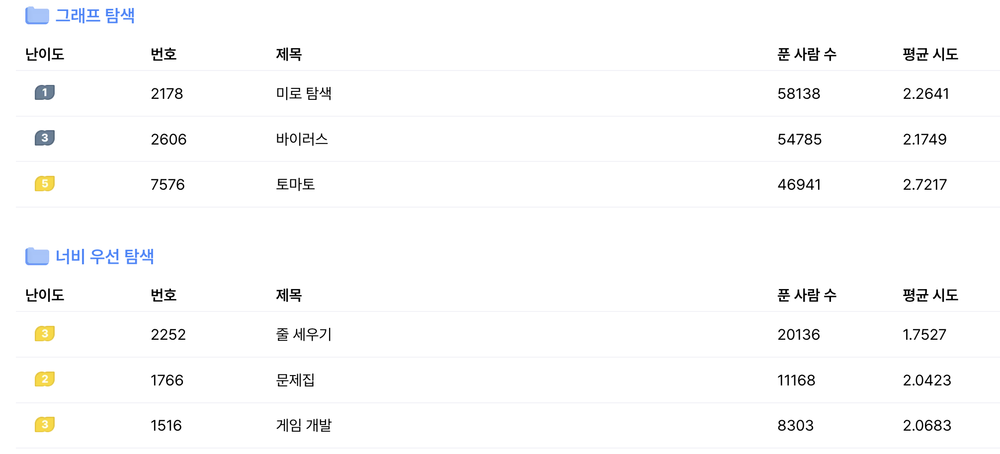
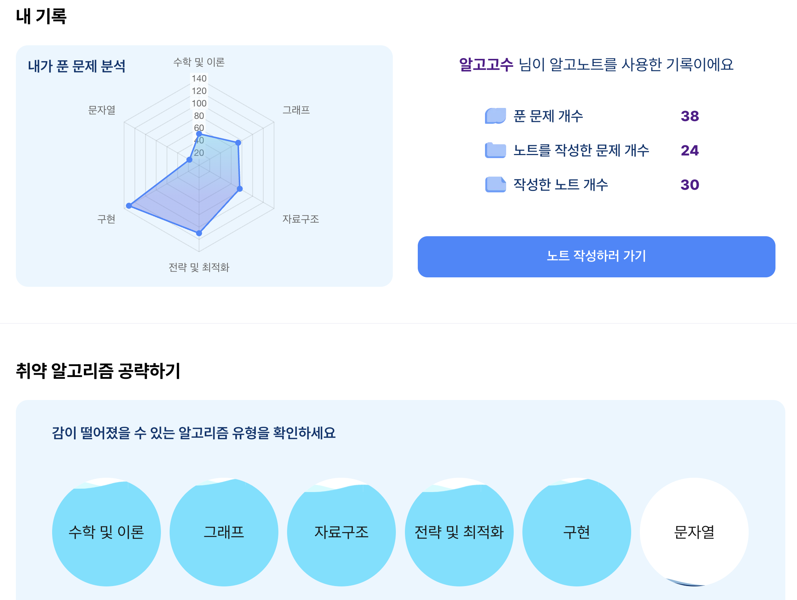
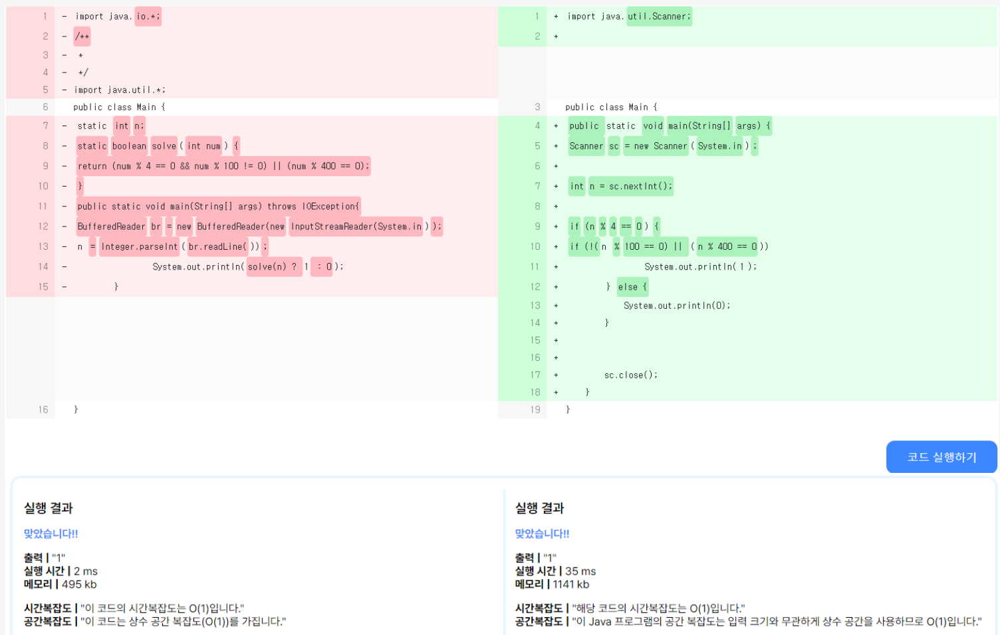
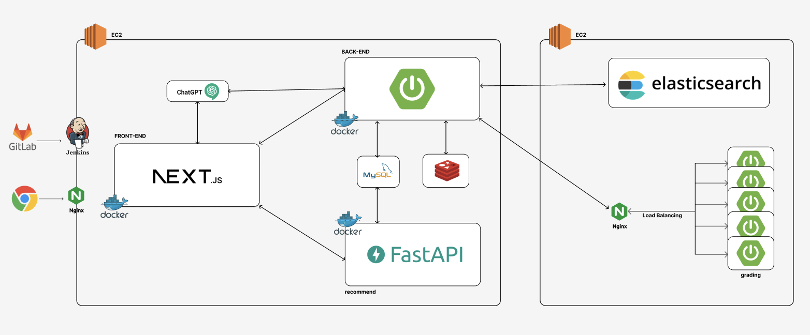

# AlgoNote 

# 🌟 서비스 소개

## Algonote - 당신의 코딩테스트 준비를 완벽하게 지원합니다

코딩테스트는 개발자의 실력을 검증하는 중요한 과정입니다. "Algonote"는 이러한 코딩테스트를 준비하는 모든 이들에게 최적의 학습 환경을 제공하기 위해 만들어진 서비스입니다. 우리는 효율적이고 체계적인 학습 방법을 통해 여러분의 실력을 한 단계 더 끌어올릴 수 있도록 지원합니다.

### 주요 기능

1. **Algonote 크롬 익스텐션**: 크롬 익스텐션을 통해 백준에서 푼 문제를 자동으로 Algonote에 가져올 수 있습니다. 이를 통해 문제 풀이 기록을 손쉽게 관리할 수 있습니다.

2. **오답노트 작성**: 틀린 문제를 복습하고 분석할 수 있는 오답노트 기능을 제공합니다. 이를 통해 자신의 약점을 파악하고, 반복 학습을 통해 실력을 향상시킬 수 있습니다.

3. **GPT-4o 활용한 챗봇**: 최신 AI 기술을 활용한 챗봇이 학습 도우미 역할을 합니다. 문제에 대한 힌트를 제공하고, 알고리즘 설명을 돕는 등 실시간으로 여러분의 학습을 지원합니다.

4. **맞춤형 문제 추천**: 개인의 학습 패턴과 수준에 맞춘 문제를 추천합니다. 이를 통해 효율적인 학습이 가능하며, 다양한 유형의 문제를 고루 풀어볼 수 있습니다.

5. **취약 알고리즘 분석**: 자신의 취약한 알고리즘을 분석하여 제공합니다. 이를 통해 어떤 부분에서 더 많은 연습이 필요한지 명확히 알 수 있어, 집중적으로 보완할 수 있습니다.

6. **코드 비교 분석**: 자신의 코드와 다른 사용자의 코드를 비교 분석할 수 있습니다. 이를 통해 다양한 접근 방식을 배우고, 더 나은 코딩 스타일을 익힐 수 있습니다.

지금 Algonote에 가입하고, 체계적이고 효율적인 코딩테스트 준비를 시작하세요. 여러분의 성공을 위해 최선을 다해 지원하겠습니다.

**Algonote - 코딩테스트의 모든 것, 여기에서 시작됩니다.**

 

# 💡 주요 기능
### 크롬 익스텐션
- 백준에 풀이를 제출하면 코드, 소요시간, 점유한 메모리, 작성언어에 대한 정보를 가져와요.

### 오답노트 작성
- 크롬 익스텐션에서 가져온 제출이력을 볼 수 있어요.

- 해당 제출이력을 바탕으로 오답노트를 작성할 수 있어요.

### GPT-4o 챗봇
- 궁금한 내용은 챗봇에게 물어볼 수 있어요. 

### 맞춤형 문제 추천
- 협업필터링 기반 알고리즘인 Bayseian Personalized Ranking 사용하여 개인화된 문제 추천시스템을 실현했어요.

### 취약 알고리즘 분석
- 푼지 오래된 문제 유형을 확인할 수 있어요.
- 이를 통해, 다양한 문제 유형에 대해 꾸준히 학습하세요.

### 코드 비교 분석
- 코드를 비교 분석해서 어떤 코드가 더 효율적인지 비교할 수 있어요.

 

# 🛠️ 주요 기술 스택

 **Management Tool**

  
 **BackEnd**

 **FrontEnd**

 **DataBase**

**ETC**

**IDE**

  

# ⚙ 시스템 아키텍쳐

 

 

# 📋 프로젝트 산출물

- [요구사항 명세서](hhttps://gpolya.notion.site/27506350933d4ca1b95afa2dfa9ed435?pvs=4)
- [API 명세서](https://gpolya.notion.site/API-10f984d494954554a612b1856fdb184a?pvs=4)
- [ERD](https://www.erdcloud.com/d/LJxsdg73o69dHFJhW)
- [와이어프레임](https://www.figma.com/file/0cwg1mhcpTudom5mSjiyMn/%EA%B3%BC%EC%99%B8-%EA%B4%80%EB%A6%AC-%EC%84%9C%EB%B9%84%EC%8A%A4?type=design&node-id=0%3A1&mode=dev&t=9JbcCbeAtpoNs2iW-1)

 

# 👩‍💻 팀원 역할 분배

| 이민우           | 김성재   | 김희수   | 김성현  | 이은규 | 조은영  |
| ----------------- | -------- | -------- | ------- | ------- | ------- |
|  | | |  |  |  |
| Leader & Backend | Backend | Backend | Frontend | Frontend | Frontend |

